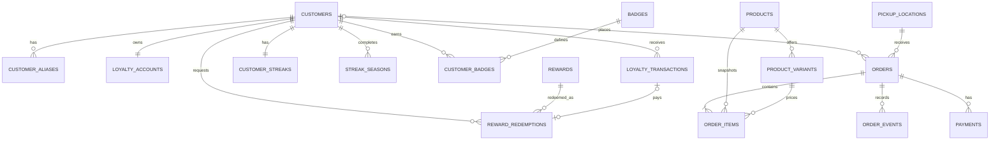

# Donas Racha — esquema Supabase de fase 2

Este diseño convierte las hojas actuales en un modelo relacional sin retirar Google Sheets ni Apps Script. La migración de datos ocurre en la fase 5. Supabase no recibe tráfico de la aplicación durante esta fase.

## Decisiones principales

- `customers.id` es el UUID interno. `customers.public_id` conserva el identificador visible `C...`; `customer_aliases` permite resolver identificadores antiguos, tokens QR y teléfonos sin usarlos como autenticación.
- `auth_user_id` queda nullable y único para enlazar Supabase Auth en la fase 3. Conocer `public_id`, un teléfono o un QR no concede acceso.
- `loyalty_accounts` ofrece el saldo actual para lecturas rápidas. `loyalty_transactions` es el libro inmutable de movimientos y conserva saldo posterior, origen e idempotencia. La API deberá actualizar ambos en una sola transacción.
- Puntos acumulados, disponibles y ganados por compras permanecen separados porque el sistema actual ya distingue esos conceptos y los canjes no reducen los puntos históricos.
- Rachas actuales y temporadas históricas están separadas. Solo puede existir una temporada `ACTIVE` por cliente.
- `rewards` representa la tienda de puntos. `products` y `product_variants` representan artículos de venta; no se mezclan recompensas con catálogo comercial.
- Los pedidos guardan snapshots de nombre, SKU y precio. El cliente enviará variante y cantidad; una función servidor calculará subtotal y total en la fase 4.
- Los importes monetarios se guardan como centavos enteros y código ISO de moneda. No se usa `float`.
- Borrados en entidades históricas usan `ON DELETE RESTRICT`. Las bajas operativas se modelan con `active` o `status`.
- Todas las tablas tienen RLS habilitado y no tienen políticas en esta fase. Por ello quedan cerradas para `anon` y `authenticated` hasta que la fase 3 defina identidad y permisos.

## ERD



## Mapeo desde Google Sheets

| Hoja | Destino | Tratamiento |
|---|---|---|
| `Clientes` | `customers`, `customer_aliases`, `loyalty_accounts`, `customer_streaks` | El ID actual se conserva como `public_id` y alias `LEGACY_ID`. Nivel y saldos se importan sin recalcular historia. |
| `Registros` | `loyalty_transactions` | Cada `IDRegistro` será `source_id`; los registros no monetarios se clasificarán antes de insertar. |
| `Insignias` | `badges` | Las definiciones conocidas se incluyen como datos de referencia. |
| `ClienteInsignias` | `customer_badges` | La PK compuesta impide asignaciones duplicadas. |
| `TemporadasRacha` | `streak_seasons` | Conserva número, fechas, hitos, puntos, nivel y estado. |
| `TiendaRecompensas` | `rewards` | Sigue siendo catálogo de canjes, separado del catálogo de venta. |
| `Canjes` | `reward_redemptions` y movimiento de puntos enlazado | Se preservan costo y nombre como snapshots. |
| `Config` | Sin tabla todavía | Las claves públicas y secretos necesitan clasificación antes de diseñar su almacenamiento. |
| `Migracion` | Reporte de fase 5 | No se copia como dominio de negocio. |

## Índices y consultas objetivo

| Consulta | Índice |
|---|---|
| Cliente por ID público | único funcional `upper(public_id)` |
| Cliente por alias heredado/QR/teléfono | único `(alias_type, alias_value)` |
| Historial de puntos | `(customer_id, occurred_at desc, id desc)` |
| Ranking | saldo y nivel se leen desde `loyalty_accounts`; el índice específico se añadirá al confirmar el ranking de producción y su paginación |
| Temporada activa | único parcial por `customer_id` cuando está `ACTIVE` |
| Canjes pendientes | `(status, created_at)` |
| Catálogo visible | índices parciales por orden cuando `active` |
| Pedido por código público | `unique(public_code)` |
| Pedidos del cliente | `(customer_id, created_at desc)` |
| Cola administrativa | `(status, created_at)` |
| Items por pedido/producto | `(order_id)` y `(product_id, product_variant_id)` |

No se duplican índices que PostgreSQL ya crea para PK o `UNIQUE`. Las claves foráneas usadas desde el lado hijo tienen índices explícitos cuando forman parte de consultas operativas.

## Integridad y concurrencia

- `idempotency_key` es obligatorio en pedidos, pagos y canjes; también está disponible en movimientos de puntos.
- `source_system + source_id` evita importar dos veces el mismo registro de Sheets. PostgreSQL permite varios `NULL`, por lo que las operaciones nuevas sin referencia heredada siguen siendo válidas.
- El saldo nunca puede ser negativo y los puntos históricos deben cubrir los saldos derivados.
- Estados terminales de pedidos y pagos exigen su timestamp correspondiente.
- Un item calcula `line_total_cents` dentro de PostgreSQL. La suma del pedido seguirá siendo responsabilidad de una función transaccional servidor; una restricción `CHECK` no puede sumar filas hijas.
- Los cambios de estado se registran en `order_events`. Las transiciones permitidas se impondrán en la API transaccional de fase 4.

## Alcance aplazado

No se crean todavía ventas, inventario, gastos, capital, préstamos, deudas, socios, reparto de ganancias, dispositivos o sincronización offline. Esas entidades dependen del modelo real de Dona Control, que aún no está disponible. `products`, pedidos y pagos cubren únicamente el contrato mínimo ya definido para las fases 7 y 8.

## Aplicación y reversión

En un proyecto Supabase de desarrollo vacío:

```bash
supabase db reset
```

El CLI aplica en orden los archivos de `supabase/migrations`. La reversión destructiva de una base exclusivamente de pruebas está en `supabase/rollback/202609200001_phase2_down.sql`. Nunca debe ejecutarse contra producción ni contra una base que ya contenga datos migrados.

La migración crea niveles, insignias y recompensas equivalentes a Apps Script. No crea clientes, pedidos ni datos privados.

