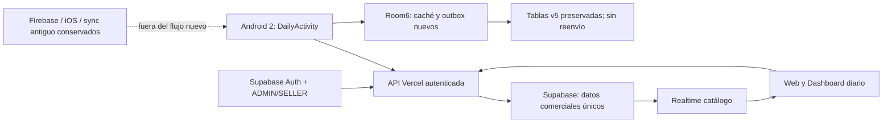

# Arquitectura vigente

[Contexto](../AI_CONTEXT.md). Código local revisado; activación real pendiente.

```mermaid
flowchart LR
  android["Android 2: DailyActivity"] --> api["API Vercel autenticada"]
  web["Web y Dashboard diario"] --> api
  api --> pg["Supabase: datos comerciales únicos"]
  android --> room["Room6: caché y outbox nuevos"]
  room --> saved["Tablas v5 preservadas; sin reenvío"]
  auth["Supabase Auth + ADMIN/SELLER"] --> api
  pg --> rt["Realtime catálogo"] --> web
  legacy["Firebase / iOS / sync antiguo conservados"] -. fuera del flujo nuevo .-> android
```
