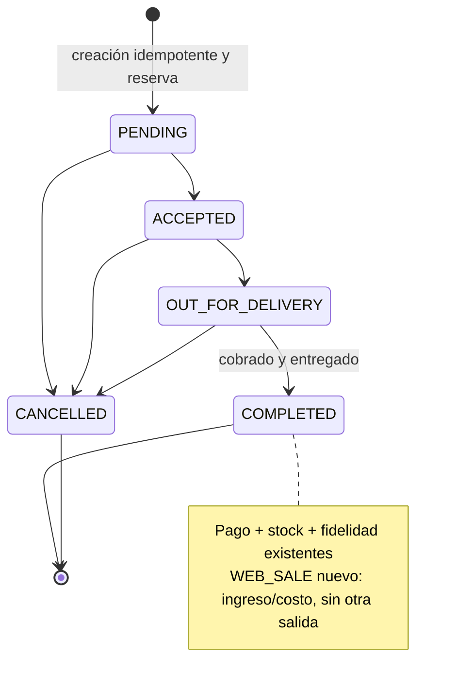

# Pedidos existentes y recibo nuevo

[Contexto](../AI_CONTEXT.md). Código local revisado; activación real pendiente.

```mermaid
stateDiagram-v2
  [*] --> PENDING: creación idempotente y reserva
  PENDING --> ACCEPTED
  PENDING --> CANCELLED
  ACCEPTED --> OUT_FOR_DELIVERY
  ACCEPTED --> CANCELLED
  OUT_FOR_DELIVERY --> COMPLETED: cobrado y entregado
  OUT_FOR_DELIVERY --> CANCELLED
  COMPLETED --> [*]
  CANCELLED --> [*]
  note right of COMPLETED
    Pago + stock + fidelidad existentes
    WEB_SALE nuevo: ingreso/costo, sin otra salida
  end note
```
