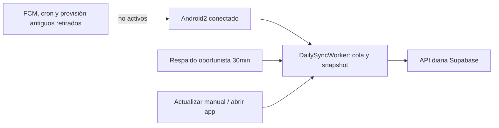

# Límite actual de actualización

[Contexto](../AI_CONTEXT.md). Código local revisado; activación real pendiente.

```mermaid
flowchart LR
  app["Android2 conectado"] --> worker["DailySyncWorker: cola y snapshot"]
  backup["Respaldo oportunista 30min"] --> worker
  worker --> api["API diaria Supabase"]
  button["Actualizar manual / abrir app"] --> worker
  retired["FCM, cron y provisión antiguos retirados"] -. no activos .-> app
```
