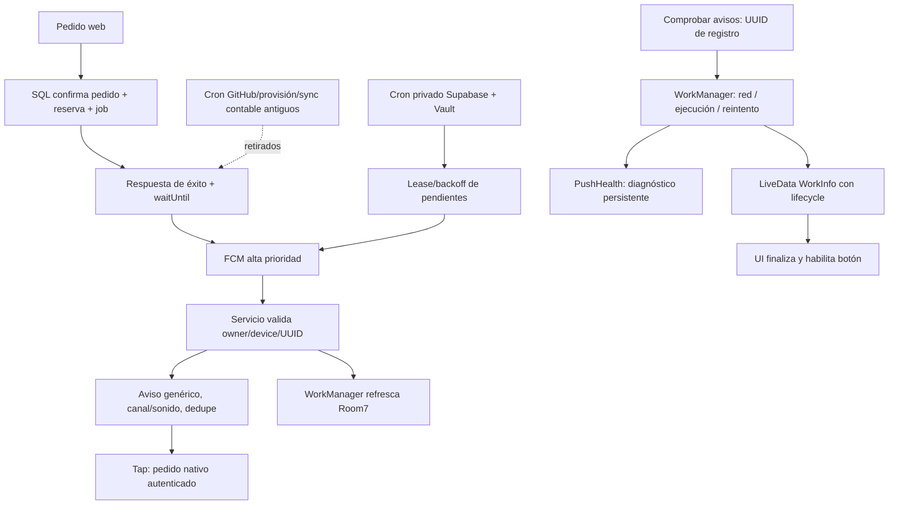

# 04-notifications

[Contexto](../AI_CONTEXT.md)

```mermaid
flowchart TD
  web["Pedido web"] --> tx["SQL confirma pedido + reserva + job"]
  tx --> api["Respuesta de éxito + waitUntil"] --> send["FCM alta prioridad"]
  cron["Cron privado Supabase + Vault"] --> lease["Lease/backoff de pendientes"] --> send
  send --> service["Servicio valida owner/device/UUID"]
  service --> alert["Aviso genérico, canal/sonido, dedupe"] --> tap["Tap: pedido nativo autenticado"]
  service --> work["WorkManager refresca Room7"]
  check["Comprobar avisos: UUID de registro"] --> registration["WorkManager: red / ejecución / reintento"]
  registration --> health["PushHealth: diagnóstico persistente"]
  registration --> state["LiveData WorkInfo con lifecycle"] --> result["UI finaliza y habilita botón"]
  old["Cron GitHub/provisión/sync contable antiguos"] -. retirados .-> api
```
