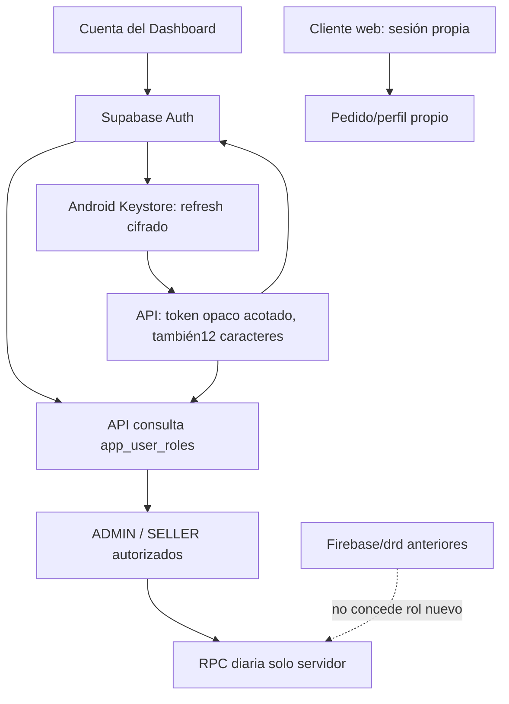

# 05-identities

[Contexto](../AI_CONTEXT.md)

```mermaid
flowchart TD
  staff["Cuenta del Dashboard"] --> auth["Supabase Auth"]
  auth --> role["API consulta app_user_roles"]
  role --> allowed["ADMIN / SELLER autorizados"] --> daily["RPC diaria solo servidor"]
  auth --> refresh["Android Keystore: refresh cifrado"]
  refresh --> renewal["API: token opaco acotado, también12 caracteres"]
  renewal --> auth
  renewal --> role
  customer["Cliente web: sesión propia"] --> private["Pedido/perfil propio"]
  old["Firebase/drd anteriores"] -. no concede rol nuevo .-> daily
```
