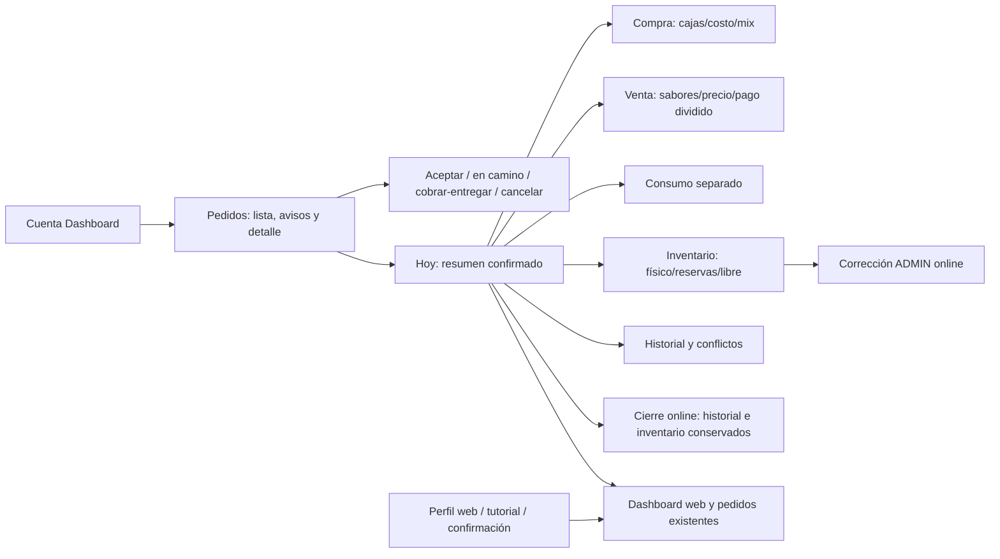

# 06-ui

[Contexto](../AI_CONTEXT.md)

```mermaid
flowchart LR
  account["Cuenta Dashboard"] --> orders["Pedidos: lista, avisos y detalle"]
  orders --> action["Aceptar / en camino / cobrar-entregar / cancelar"]
  orders --> today["Hoy: resumen confirmado"]
  today --> purchase["Compra: cajas/costo/mix"]
  today --> sale["Venta: sabores/precio/pago dividido"]
  today --> consume["Consumo separado"]
  today --> inventory["Inventario: físico/reservas/libre"]
  inventory --> correction["Corrección ADMIN online"]
  today --> history["Historial y conflictos"]
  today --> close["Cierre online: historial e inventario conservados"]
  today --> dashboard["Dashboard web y pedidos existentes"]
  profile["Perfil web / tutorial / confirmación"] --> dashboard
```
